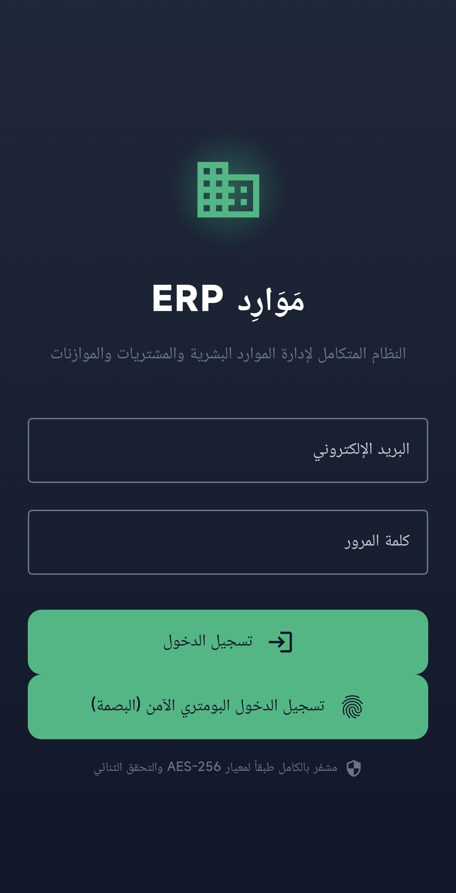
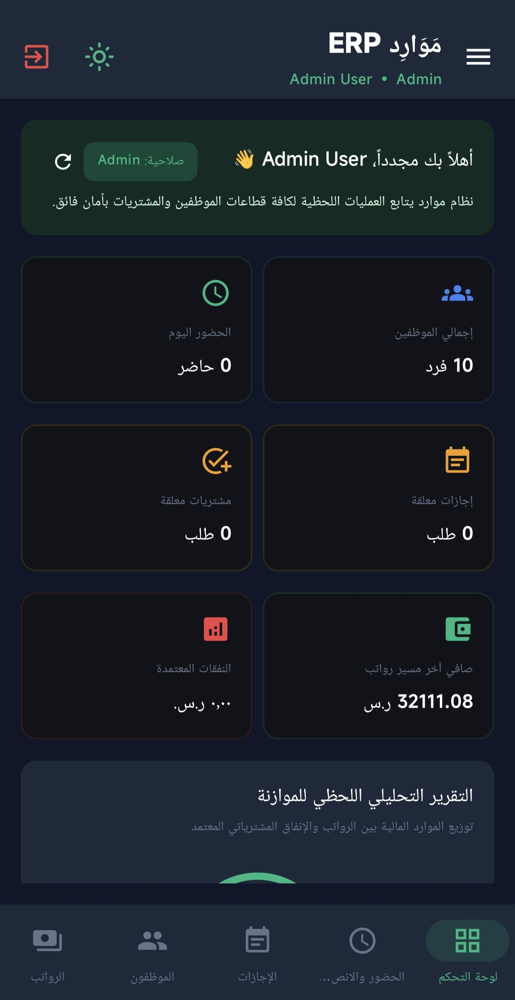
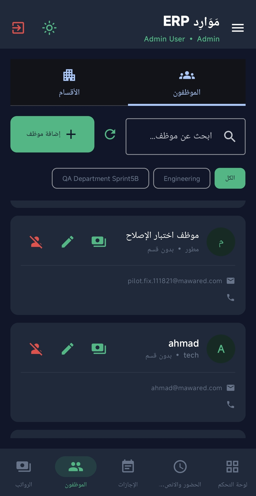
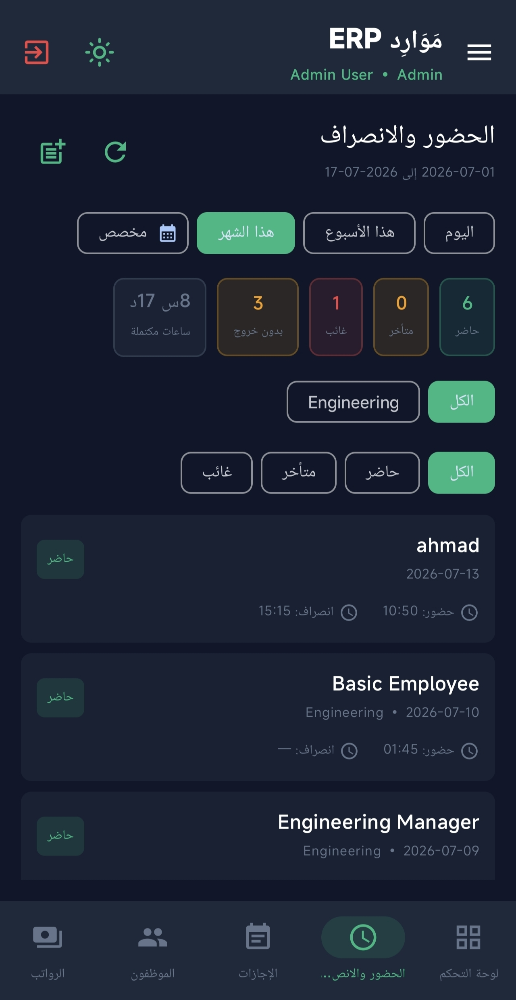
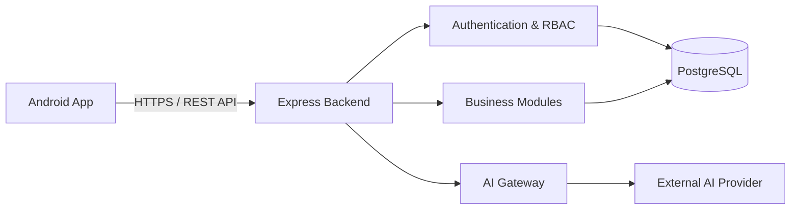

# Mawared ERP | موارد

### Mobile-first HR & enterprise operations platform
### منصة عربية لإدارة الموارد البشرية وعمليات الشركات

---

## العربية

**موارد ERP** هو مشروع تجاري لنظام موارد بشرية وإدارة عمليات متعدد الشركات، مصمم بواجهة عربية ودعم اتجاه الكتابة من اليمين إلى اليسار. يهدف النظام إلى جمع إدارة الموظفين والحضور والإجازات والصلاحيات والرواتب والمشتريات والتقارير في منصة واحدة قابلة للتوسع.

هذا المستودع مخصص **لعرض المنتج فقط**. الكود المصدري الكامل، إعدادات النشر، مخطط قاعدة البيانات التفصيلي، الأسرار، وبيانات التشغيل محفوظة في مستودع خاص وغير منشورة هنا.

### روابط سريعة

- [موقع عرض المنتج](https://baselzaid-dev.github.io/mawared-erp-showcase/)
- [المعمارية العامة](docs/ARCHITECTURE.md)
- [خارطة التطوير](docs/ROADMAP.md)
- [حزمة النشر للمجتمع](docs/SHARE_KIT.md)
- [إرسال ملاحظة أو اقتراح](https://github.com/baselzaid-dev/mawared-erp-showcase/issues/new/choose)

### النطاق الوظيفي

- إدارة الموظفين والأقسام والهيكل التنظيمي.
- تسجيل الدخول وإدارة الجلسات والصلاحيات حسب الدور.
- حضور وانصراف وطلبات الاستراحة والتقارير المرتبطة بها.
- إجازات بمسارات اعتماد متعددة المراحل.
- رواتب ومشتريات وموردون وعمليات مالية ضمن خارطة التطوير.
- محادثات داخلية وتقارير تشغيلية.
- مساعد ذكاء اصطناعي يتم الوصول إليه عبر الخادم، وليس مباشرة من التطبيق.
- دعم تعدد الشركات وعزل بيانات كل شركة.

### حالة المشروع

المشروع قيد التطوير النشط ويُختبر ضمن بيئة مرحلية وتجربة مضبوطة. الأساس الحالي يشمل تطبيق Android وخادمًا خلفيًا وقاعدة PostgreSQL، مع استمرار تطوير الوحدات التجارية المتقدمة وتحسين الجاهزية للإنتاج.

> المعلومات الموجودة هنا وصف عام للمنتج، ولا تتضمن بيانات دخول أو عناوين تشغيل خاصة أو أسرارًا أو كودًا تجاريًا.

---

## English

**Mawared ERP** is a commercial, multi-company HR and enterprise operations platform designed with Arabic RTL support and a mobile-first experience. It is intended to bring employee administration, attendance, leave workflows, permissions, payroll, procurement, and operational reporting into one extensible system.

This repository is a **product showcase only**. The complete source code, deployment configuration, detailed database schema, secrets, and operational data remain private and are not published here.

### Product scope

- Employee, department, and organization management.
- Authentication, secure session handling, and role-based access control.
- Attendance, breaks, and related operational reporting.
- Multi-stage leave approval workflows.
- Payroll, procurement, suppliers, and finance capabilities on the product roadmap.
- Internal communication and business reporting.
- A server-mediated AI assistant; the mobile client does not call the AI provider directly.
- Multi-company architecture with tenant data isolation.

## Product screenshots | شاشات المنتج

<table>
<tr>
<td align="center" width="25%"> <b>Secure Login</b> تسجيل الدخول الآمن</td>
<td align="center" width="25%"> <b>Executive Dashboard</b> لوحة التحكم</td>
<td align="center" width="25%"> <b>Employees</b> إدارة الموظفين</td>
<td align="center" width="25%"> <b>Attendance</b> الحضور والانصراف</td>
</tr>
</table>

Public screenshots use demo or controlled staging data and do not expose production credentials or customer information.

## Technology overview

| Layer | Technology |
|---|---|
| Mobile application | Kotlin, Jetpack Compose, ViewModel, Repository pattern |
| Backend | TypeScript, Node.js, Express |
| Data access | Prisma ORM |
| Database | PostgreSQL hosted on Supabase |
| Authentication | JWT access and refresh-token architecture |
| Deployment | Managed staging environment |

## High-level architecture

Security and product details are intentionally presented at a high level. See [Architecture](docs/ARCHITECTURE.md) and [Roadmap](docs/ROADMAP.md) for the public overview.

## Project status

| Area | Public status |
|---|---|
| Android application foundation | Active development |
| Authentication and permissions | Implemented and being hardened |
| Employee management | Connected to backend |
| Leave workflows | Active development and verification |
| Attendance | Active development |
| Payroll and procurement | Incremental implementation |
| Production rollout | Controlled pilot preparation |

## Community and feedback

- Read [CONTRIBUTING.md](CONTRIBUTING.md) before opening an issue.
- Use the structured [product feedback form](https://github.com/baselzaid-dev/mawared-erp-showcase/issues/new/choose).
- Use [SECURITY.md](SECURITY.md) for responsible security reporting.
- Ready-to-edit public announcements are available in the [community share kit](docs/SHARE_KIT.md).

## Repository policy

- No production credentials or environment files are stored here.
- No employee or customer data is stored here.
- No executable commercial source code is published here.
- This is not an open-source distribution.
- No permission is granted to copy, redistribute, sell, or create derivative commercial products from protected Mawared materials.

## Ownership

Copyright © 2026 Basel Zaid. All rights reserved.

For product or collaboration enquiries, use the contact options available on the repository owner's GitHub profile.
