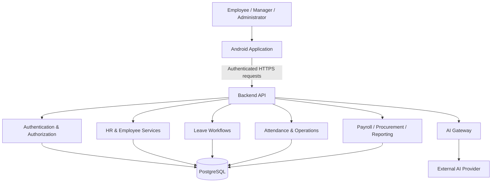

# Mawared ERP — Public Architecture Overview

This document describes the product architecture at a deliberately high level. It does not expose private endpoints, database credentials, deployment identifiers, internal authorization mappings, or implementation details.

## Design goals

- Arabic-first Android experience with full RTL support.
- Clear separation between user interface, state management, repositories, and remote services.
- A single backend authority for authentication, authorization, tenant isolation, and business rules.
- Multi-company operation without trusting client-supplied tenant identifiers.
- Incremental delivery of HR, attendance, leave, payroll, procurement, and reporting modules.
- AI features routed through the backend so provider credentials are not embedded in the mobile application.

## System context



## Mobile application

The Android client is built with Kotlin and Jetpack Compose. Its public architectural direction follows:

```text
Compose UI
   ↓
ViewModel / UI state
   ↓
Repository interfaces
   ↓
Remote API and controlled local/demo data sources
```

The client is treated as an untrusted presentation layer. Sensitive permissions and company boundaries must be enforced by the backend even when the application hides unavailable actions in the interface.

## Backend

The backend is built with TypeScript, Node.js, Express, and Prisma. It is responsible for:

- Authentication and session lifecycle.
- Role-based permission enforcement.
- Company and tenant isolation.
- Business workflow validation.
- Database access.
- Server-side AI integration.
- Audit-oriented operational controls.

## Data layer

PostgreSQL is used as the primary relational database, with Prisma as the application data-access layer. The detailed schema and migrations remain private because they form part of the commercial implementation.

## Security posture

The public design principles include:

- HTTPS for deployed application traffic.
- Short-lived access tokens with refresh-session handling.
- Server-enforced role-based access control.
- Tenant context derived from authenticated server-side identity.
- Secrets stored outside source control.
- Sensitive request and authentication data excluded from release logging.
- External AI credentials retained on the backend.
- Input validation, rate limiting, audit logging, and backup controls as part of production hardening.

This overview is informational and is not a claim that every planned production control is complete. Security verification continues as the product moves through controlled pilot preparation.
